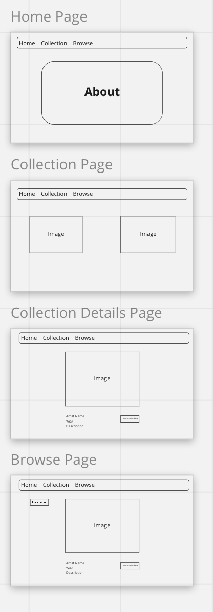

# Virtual Gallery React

In this project I'll be using the Metropolitian museum of Modern Art's public API to build a virtual Gallery.  I will use this API to curate and host a collection of works for site visitors to view.  On the collection page they'll be able to view the entire current collection, and if they click on a work of art they'll be provided with more details on the work.  There will also be a  browse page which will have a button that will return a random work of art from the MET's over 400,000 works on available on their API. 

## User Story

User's shouldn't have to login to view anything on this site.  They're simply here to view the collections of The MET. Users can browser a curated collection, or they can browse the API on their own on the Browse page. 

### Wireframes

### MVP

- Access data from MET api and index a curated collection
- Render show Page for Items in curated Collection
- Browse Page which will have a Button to Randomly Access items from entire MET collection for Users to Browse
- Build React Front End with Clean Styling using Flexbox or Grid Layout
- Professional looking Clean styling

### Stretch

- On the Browse page allow users to select catagories/Artists/Collections to narrow search results
- implement Bootstrap or another styling tool beyond flexbox
- Find a Really nice NavBar template
