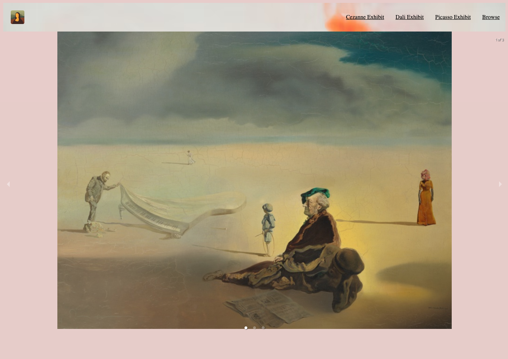
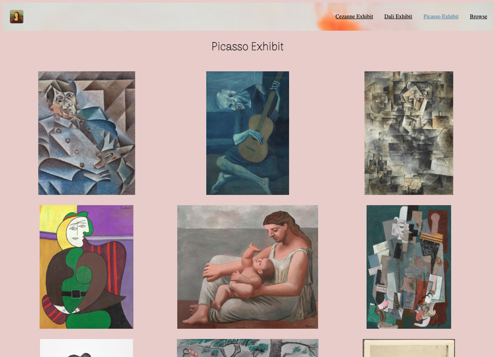
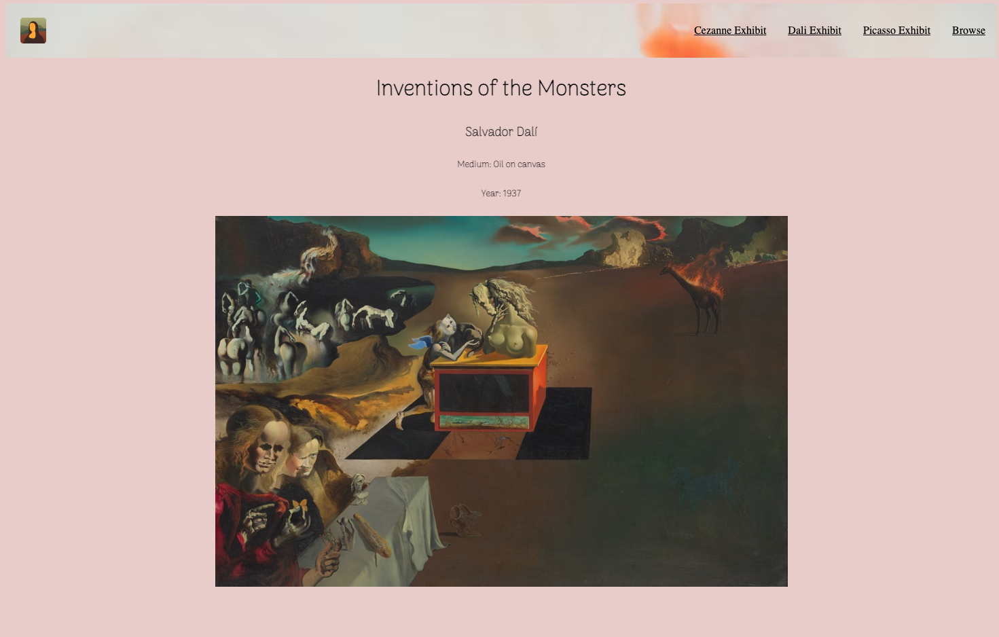
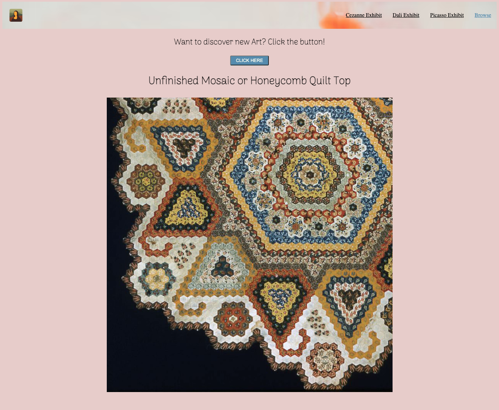

# Virtual Gallery React

For this project I essentially built a React front end for the Art Institute of Chicago's public API. It is designed to be a virtual gallery featuring 3 artist exhibits.  There is also a Browse page that allows visitors to click a button to randomly generate a work of art from the Art institutes database of about 120 thousand works of art.   

### Images of Site

### Tech Used

Javascript, JSX, React, CSS, React Router, React responsive carousel, React styled components, Node, Grid, icons8

### Next Steps

My future plans for this site are to update either on a monthly or quarterly basis.  Updates would include new artist exhibits, updated styling to reflect the asthetic of the updated exhibits, and new features TBD. I also plan to share this project with the Art institute of Chicago so I can share what I've done with their API.

### Contribution Guidelines

If you run into any bugs please feel free to submit and issue on this github page.  If you'd like to submit any updates feel free to fork clone and submit a pull request and I can review your code!

## References

- https://reactjs.org/docs/getting-started.html
- https://www.positronx.io/react-responsive-carousel-tutorial/
- https://stackoverflow.com/questions/3910736/-     how-to-call-multiple-javascript-functions-in-onclick-event
- https://www.youtube.com/watch?v=VzWBLj_CfpE
- https://react.school/ui/button